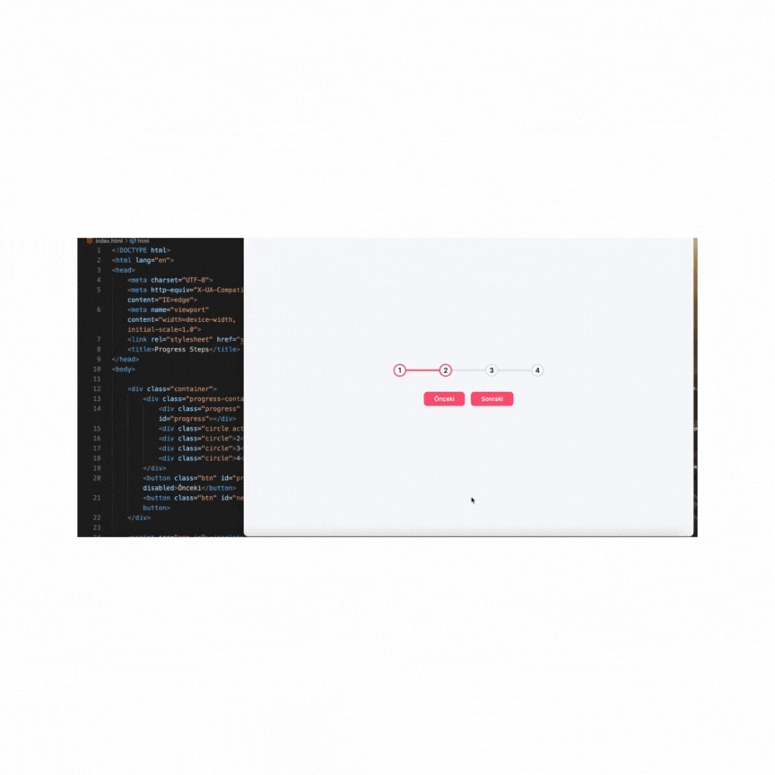

# ProgressSteps

##🚀Animated Progress Steps

✅This project is an animated progress steps component that allows users to follow a step-by-step process through a modern and interactive interface.
✅Each step is enhanced with transition animations, making it both visually appealing and smooth in terms of user experience. ✨

##🎯 Features
🔄 Step-by-step navigation with backtracking support

🎨 CSS animations for smooth transition effects

📱 Responsive design for mobile compatibility

⚡ Lightweight and fast performance

🛠 Easy customization (colors, sizes, number of steps)

##🛠 Technologies Used

⚛️ React – Component-based architecture

🎨 CSS3 – Custom animations and styles

🖼 HTML5

🛡 JavaScript (ES6+)

🎯 Optional: React Hooks for state management
